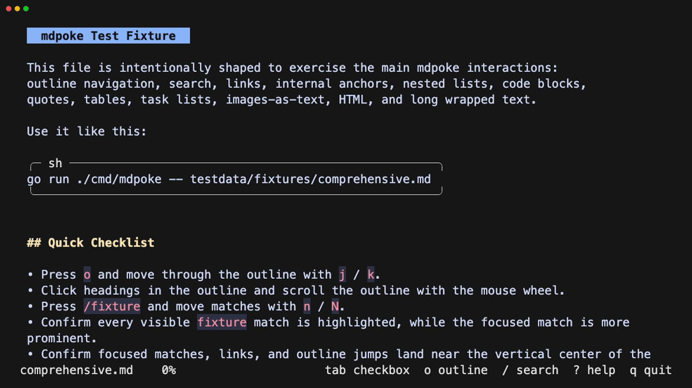

# mdpoke

`mdpoke` is a terminal Markdown viewer for poking around long Markdown documents.

It focuses on reading one Markdown file at a time, with a main rendered document view, an optional heading outline, search, task checkbox control, deliberate link copy, automatic drag-selected text copy, and a searchable key guide.

It is meant for the kind of Markdown that engineers actually live in: design notes, release checklists, long issue write-ups, runbooks, and scratch files that keep changing while another editor or command rewrites them.



## Highlights

- Read rendered Markdown without leaving the terminal, while preserving source line breaks so prose, checklists, and pasted notes keep their shape.
- Jump around long files with search, page movement, top/bottom shortcuts, and an optional heading outline.
- Work through task lists in place: focus checkboxes with `Tab`, toggle with `Space` or `Enter`, and keep the toggled item in view after it changes.
- Copy links deliberately. Keyboard copy works from the focused/current link, while mouse clicks only act when they land on the rendered URL or link text.
- Follow internal Markdown anchors with a confirmation prompt, and copy external links instead of accidentally opening a browser.
- Drag across rendered text and release to copy a clean plain-text selection immediately; the highlighted range stays visible until your next normal input.
- Leave it open while editing the file elsewhere; `mdpoke` watches the file and reloads when it changes.
- Keep long URLs and wrapped popup content readable without broken modal borders.

## Install

```sh
go install github.com/BumpeiShimada/mdpoke/cmd/mdpoke@latest
```

If `mdpoke` is not found after installing, add Go's bin directory to your shell `PATH`:

```sh
export PATH="$(go env GOPATH)/bin:$PATH"
```

For zsh, put that line in `~/.zshrc`.

For local development:

```sh
git clone https://github.com/BumpeiShimada/mdpoke.git
cd mdpoke
go install ./cmd/mdpoke
```

## Run

```sh
mdpoke README.md
```

Useful reload and file options:

```sh
mdpoke --no-watch README.md
mdpoke --max-size 10485760 README.md
mdpoke --follow-symlinks README.md
```

When developing locally without installing:

```sh
go run ./cmd/mdpoke -- testdata/fixtures/comprehensive.md
```

## Homebrew

```sh
brew install BumpeiShimada/tap/mdpoke
```

## Keys

| Key | Action |
| --- | --- |
| `j` / `k`, arrow keys | Scroll or move the outline selection |
| `g` / `G` | Jump to top / bottom |
| `o` | Toggle the outline pane |
| `Enter` / `Space` | Toggle the focused checkbox |
| `/` | Search rendered text |
| `n` / `N` | Move to next / previous search match |
| `Tab` / `Shift+Tab` | Focus next / previous checkbox |
| `y` | Copy the focused link, or the first link on the current line |
| Mouse wheel | Scroll |
| Drag | Select rendered text; release to copy it immediately |
| Click | Toggle a checkbox, copy an external link, or confirm an internal Markdown jump when clicking the rendered link text |
| `?` | Open the searchable key guide |
| `Esc` | Cancel the current mode or clear highlights/selection |
| `q` / `Ctrl+C` | Quit |

Markdown task checkboxes can be focused with `Tab` and toggled with `Enter` or `Space`.
Internal Markdown anchors such as `#heading-name` can be followed by clicking and confirming the jump.
External links are intentionally copy-first: move to their line and press `y`, or click directly on the rendered URL or link text to copy.
You can also drag across rendered document text and release to copy the selected plain text. Copy actions show a short `Copied` popup, which can be closed with any key or an outside click. After a drag-copy popup closes, the selected range remains highlighted until the next normal click or key press.

## Scope

`mdpoke` is a viewer, not an editor. It does not include file browsing; use it with shell tools, `fzf`, or your editor.

## Safety And Limits

By default, `mdpoke` watches the opened file for changes, refuses symlinked Markdown files, limits reads to 20 MiB, and strips terminal control characters before rendering or parsing links/headings.

Use `--no-watch` when automatic reloads are not desired, `--max-size` to tighten or raise the read limit, and `--follow-symlinks` only when the link target is trusted.
